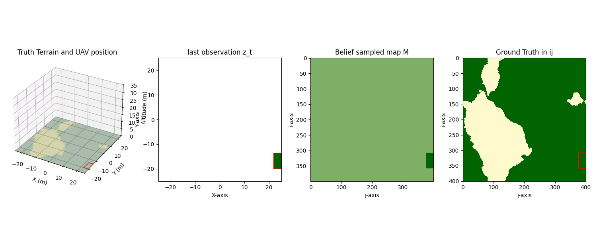
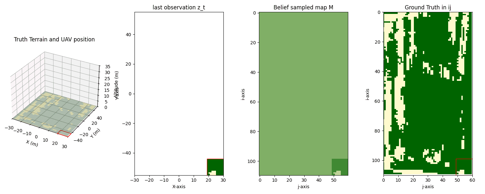

# Active Sensing for Precision Agriculture

## Overview  

**IGBIPP Towards Field Deployment** is a Python framework for **multi-UAV active sensing** in **precision agriculture**, specifically for **wheat lodging detection**. It extends prior **informative path planning (IPP)** research by integrating a **deep learning classifier** and a **realistic sensor model**, moving towards real-world deployment.  

### Key Features  
- **Adaptive UAV Path Planning:** Optimizes flight paths using **Expected Information Gain (IG)**, adjusting altitude dynamically.  
- **Deep Learning-Based Sensing:** Uses a trained **wheat lodging classifier** instead of abstract sensor models.  
- **Minimal Data Sampling:** Derives a sensor model from limited real-world data for practical deployment.  
- **Simulation & Real-World Validation:** Tested on both **simulated and real wheat fields**, bridging the gap to real applications.  

This framework improves UAV-based field monitoring by enabling **efficient, data-driven decision-making** in precision agriculture.  


### Installation  

Clone the repository and install the required packages:

```bash
git clone git@github.com:botastark/active_sensing.git
cd active_sensing
pip install -r requirements.txt
```
Ensure you have the following dependencies installed:  

- Python **3.7+**  
- **NumPy** – Numerical computations  
- **PyTorch & Torchvision** – Deep learning framework  
- **Pillow** – Image processing  
- **OpenCV** – Computer vision processing  
- **GDAL** – Geospatial data processing  
- **Matplotlib & Seaborn** – Visualization  
- **tqdm** – Progress tracking  

All dependencies are listed in `requirements.txt`.  


## Usage


### Configuration (`config.json`)  
The simulation is controlled by a configuration file (`config.json`). Below are the key parameters and their descriptions:

### Parameters:
- **`field_type`**: Defines the type of field to be analyzed. Options: `"Gaussian"` (simulated) or `"Ortomap"` (real-world orthomosaic).  
- **`start_position`**: Specifies where the UAV starts. Options: `"corner"` or `"border"`.  
- **`action_strategy`**: Path planning approach. Options: `"ig"` (information gain-based) or `"sweep"` (systematic coverage).  
- **`correlation_types`**: Defines strategies for belief propagation. Options: `"equal"`, `"biased"`, `"adaptive"`.  
- **`n_steps`**: Number of UAV movement steps per iteration.  
- **`iters`**: Number of simulation runs to execute.  
- **`error_margins`**: Defines measurement uncertainty levels for evaluation.  
- **`enable_plotting`**: Enables or disables visualization (`true`/`false`).  
- **`enable_logging`**: Enables or disables logging (`true`/`false`).  
- **`project_path`**: Absolute path to the project directory.  

### Preparing the Orthomap (for Real-World Data)
If using `"field_type": "Ortomap"`, the required orthomap dataset (1.4GB) must be placed in the `data/` directory. The download link will be provided later.

---
## Running the Simulation  

The main simulation script is executed using the configuration file.

**Run the main script:**
```bash
python src/main.py --config config.json
```

**Generate final plots and visualizations:**

Simulation results, including processed data and visualizations, are stored in the `plots/` directory.
```bash
python plotter.py
```


## Structure

```plaintext
active_sensing/
├── config.json           # Configuration file for simulation parameters
├── data/                 # Folder for datasets (e.g., orthomap.tif)
├── plots_/               # Stores generated plots and animations
├── src/                  # Main source code
│   ├── main.py           # Entry point for running the simulation
│   ├── uav_camera.py     # UAV and camera model (configuration space and observations)
│   ├── mapper_LBP.py     # Bayesian update with Loopy Belief Propagation
│   ├── planner.py        # Path planning algorithms (Information Gain-based and Sweep)
│   ├── orthomap.py       # Handles simulated Gaussian fields and real-world orthomaps
│   └── ...               # Additional modules and utilities
├── binary_classifier/    # Classifier model for wheat lodging detection
│   ├── models/           # Trained deep learning models
│   ├── predictor.py      # Model inference and prediction functions
│   ├── train.ipynb       # Training notebook for the classifier
│   └── ...               # Other relevant scripts
├── README.md             # Project documentation
├── plotter.py            # Generates final plots and comparisons
└── requirements.txt      # List of required dependencies
```

## Example
An example map generated during simulation using Gaussian field (r=4), error margin=0.3 and equal weights:


An example sweep animation generated during simulation using Orthomap field and adaptive weights:

## License & Usage Restrictions  

This repository contains research work in progress and is **not yet publicly released** for general use. Redistribution, modification, or commercial use is **strictly prohibited** without explicit permission from the authors.  

If you are interested in collaborating or using this work for research purposes, please **contact the project authors** before proceeding.  
